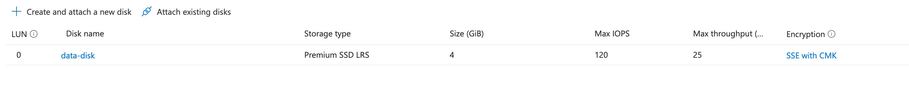
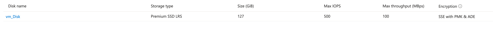

# Azure Data Disks
Azure Disks

## Disk Types
<details>

- Standard HDD
- Standard SSD
- Premium SSD
- Ultra Disk

</details>

## Disks Snapshot

## Disk Encryption
* ADE - Azure Disk Encryption.

* ADE encryption:
  * BitLocker for encryption of Windows VMs
  * dm-crypt feature for Linux VMs.

* SSE with PMK - Server Side Encryption with Platform Manager Key.

* Customer Keys for encrption with Azure Key Vault

### Azure Key Vault
Azure Key Vault is a cloud service that provides a secure store for secrets. You can securely store keys, passwords, certificates, and other secrets. Azure key vaults may be created and managed through the Azure portal. In this quickstart, you create a key vault, then use it to store a secret.

- Create Key Vault
- Disk Encryption Set
- grant permission to the Key Vault
- from the disk:
    - encryption
    - CMK with Encryption Set




 ### Encryption at REST
 _Encryption at rest is designed to prevent the attacker from accessing the unencrypted data by ensuring the data is encrypted when on disk. If an attacker obtains a hard drive with encrypted data but not the encryption keys, the attacker must defeat the encryption to read the data._

 ## ADE - Azure Disk Encryption
 [Overview of managed disk encryption options](https://learn.microsoft.com/en-us/azure/virtual-machines/disk-encryption-overview)
 - VM disks
 - Additional Settings
 - Select the Key Vault

 


## Adding Data Disks to VM VM with Power Shell
:bangbang:
```powershell
$resourcegroup = 'az-104'
$machinename = 'enrico-win-vm'
$location = 'North Europe'
$storageType = 'Standard_LRS'
$dataDiskName = 'newdisk01'
$dataDiskSize = 10
 
$datadiskConfig = New-AzDiskConfig -SkuName $storageType -Location $location -CreateOption Empty -DiskSizeGB $dataDiskSize
 
$dataDisk01 = New-AzDisk -DiskName $dataDiskName -Disk $datadiskConfig -ResourceGroupName $resourcegroup
 
$vm = Get-AzVM -Name $machinename -ResourceGroupName $resourcegroup
 
$vm = Add-AzVMDataDisk -VM $vm -Name $dataDiskName -CreateOption Attach -ManagedDiskId $dataDisk01.Id -Lun 1
 
Update-AzVM -VM $vm -ResourceGroupName $resourcegroup
```
