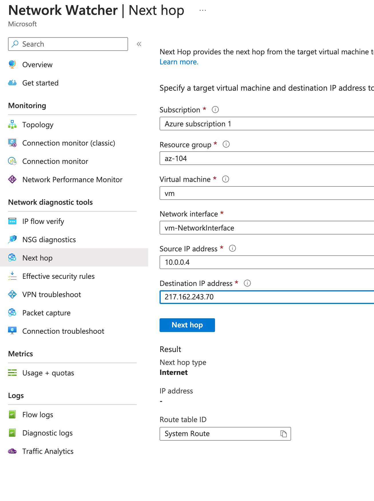

# Network Watcher
- **Connection Monitor**: check network connectivity between machines
- **Next hop**: next route for a packet of data
- **IP Flow Verify**: check if traffic is allowed to/from a VM
- **Connection troublehsoot**: 
- **NSG Diagnostic**
- **Traffic Analyitics**
- **NSG Flow Logs**
- **Network Watcher variable packet capture**
## Connection Monitor
- Specific for a given region
- check connectivity between 2 VMs
- Network Watcher/Connection Monitor
- Data is stored into Log Analytics Workspace
- Test grp/Source/Destination/Test Configuration
- VM needs to install the _Network Watcher Agent for Windows_

## IP Flow verify
Check if traffic is allowed to/from a (single) VM
- Network Watcher/IP Flow verify
- Target vm port 80
- remote ip address: my IP (217.162.243.60)
## Next Hop
- Network Watcher/Next Hop
- from Azure VM to my IP
- Next hop type: Internet

- from vm1 (private IP) to vm2 (private IP)
- Next hop type: VirtualNetwork

## NSG Diagnostic - 176
The Network Security Group (NSG) Diagnostics tool provides detailed information to understand and debug the security configuration of your network.  
Network Watcher / NSG diagnostic

Network Watcher/NSG Diagnostic
## NSG Flow Logs - 177
- Network Watcher/NSG Flow Logs
- NSG
- Requires storage account & Log Analytic Workspace
- in the folder of storage account you will find the log file, i.e. PT1H.json
- Log format in the MS documentation
- Network Watcher | Traffic Analytics

