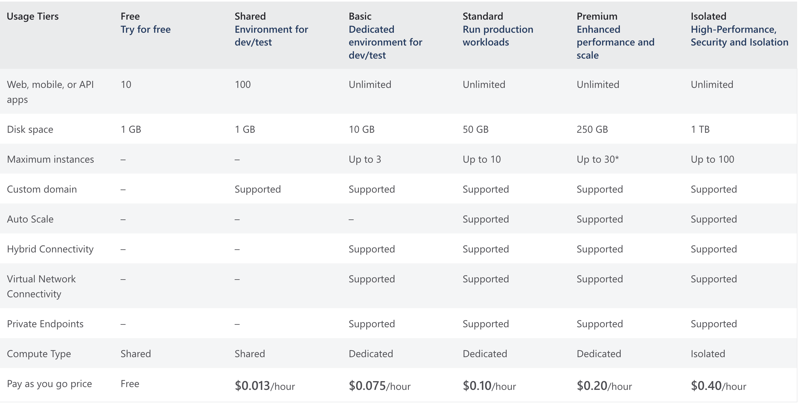
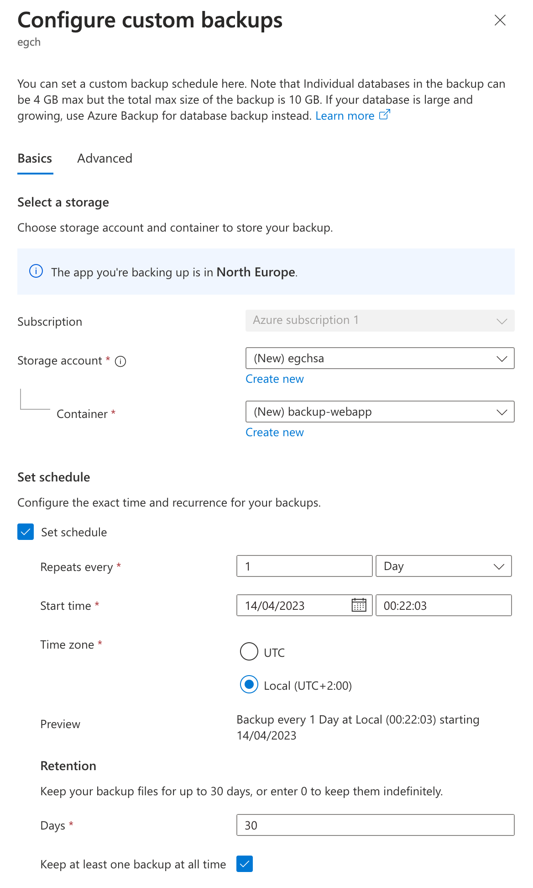

# Azure Web Apps
## App Service Plan
- Shared: custom domain,
- Basic: custom domain,
- Standard: custom domain, Auto-scaling, Virtual Network connectivity

webapp - fixed sufix: .azurewebsites.net.  
Example: 
<em>egchwa.azurewebsites.net</em>

### App Service Plan Comparison

**Backup and restore are supported in Basic or higher**

### Deployment Slots
Service Plan: Standard or higher.  
Add slot/Swap

### AutoScaling
Service Plan: Standard or higher.  

|  PLan | Scaling | 
|:----------|:-------------|
|  Basic | Manual up to 3 instances |
|  Standard or higher  | Autoscaling |

Rule: cpu/memory  
Max instance count

### Virtual Network Integration
Service Plan: Basic or higher.  
Connecting webapp to a private network, for instances to access to a DB.

### Custom Domains
Service Plan: Shared or higher.  
Add to your domain provider the following two DNS entries:
- A record
- TXT record

### SSL
Service Plan: Basic or higher.  
WebApp/SSL/Create App Service Managed Certificate  
Binding

### Backups
- Service Plan: Standard or higher.  
- Storage Account is needed

Restore a prev state into a new webapp.

Storage Account is required for custom backup.

<figure>
   
  <figcaption>Scheduled backup</figcaption>
</figure>

### Zone Redundancy
Only Premium

## Web App Logging
Webapp:
- App Service Logs
- Log Stream

- Application Logging - logs generated by the application code
- Web Server Logging - records raw HTTP request data
### Configuration
- webapp/App Service Logs/enable Web Server Logging
- webapp/log Stream/ you can see log at runtime (like tail)

### Extra
- [deploy spring-boot on Azure](https://learn.microsoft.com/en-us/azure/app-service/quickstart-java?pivots=platform-linux-development-environment-maven&tabs=javase)