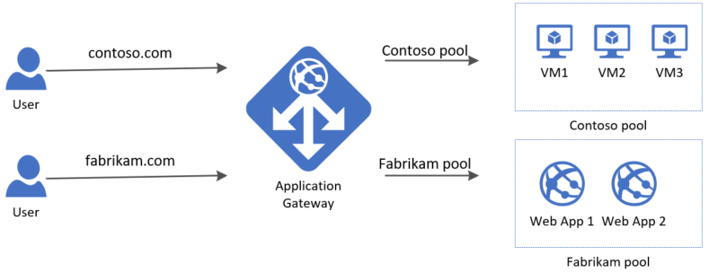

# Application Gateway
## What is Azure Application Gateway?
Azure Application Gateway is a web traffic load balancer that enables you to manage traffic to your web applications. Traditional load balancers operate at the transport layer (OSI layer 4 - TCP and UDP) and route traffic based on source IP address and port, to a destination IP address and port.

Application Gateway can make routing decisions based on additional attributes of an HTTP request, for example URI path or host headers. For example, you can route traffic based on the incoming URL. So if /images is in the incoming URL, you can route traffic to a specific set of servers (known as a pool) configured for images. If /video is in the URL, that traffic is routed to another pool that's optimized for videos.

## Features
- OSI Layer 7 
- Web application Firewall feature
- SSL/TLS
- Autoscaling
- Session affinity
## Components
- Frontend IP address
- Listener:
    - Basic
    - Multi site
- Routing Roules
    - Basic
    - Path-based
- Backeend pools
- Health Probes

Backend pool can be composed by anything but in the VM. Even on premises VM or webapp. (TBV)

## Lab - URL Routing
- create vm1(videos), vm2(images)
- create subnet in the VN - appSubnet
- create Application Gateway
- link the AP to the appSubnet
- create a new public IP (standard SKU/static)
- add 2 backend pools:
    - imagespool: vm1
    - videospool: vm2
- Configuration:
    - routing rule (URL routing)
    - mapping the url(s) to their respective backend pool

## AG Multiple Sites
_Multiple site hosting enables you to configure more than one web application on the same port of application gateways using public-facing listeners._

### DNS configuration
- dns label in the public IP
- CNAME entry with the dns name (in all the godaddy domains)

## Application Gateway - WAF
Azure Web Application Firewall (WAF) on Azure Application Gateway provides centralized protection of your web applications from common exploits and vulnerabilities. Web applications are increasingly targeted by malicious attacks that exploit commonly known vulnerabilities. **SQL injection and cross-site scripting** are among the most common attacks.

