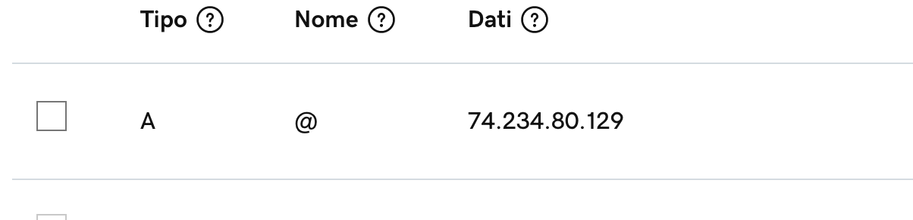
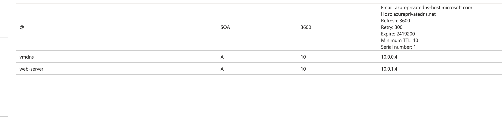

# DNS - Domain Name System 


**Context**: Azure public DNS zone named enricogiurin.com. They also have the domain name registered as part of an external domain registrar. They want to ensure that records from the Internet get routed to their Azure DNS zone.

**Solution**: Modify the **NS** record in the external domain system (www.enricogiurin.com)

## Mapping (GoDaddy)
Type **A** Record Points to IP.

I map my domain to the public IP of my VM, through an A record in the DNS section of my domain configuration.



## Difference NS vs A record
Q: what is the difference between **A** and **NS** record in a website domain?
A: A and NS records are two types of DNS (Domain Name System) records that are used to manage the domain name system for a website.

An **A** record (Address record) is used to map a domain name to an IPv4 address. When a user types in a domain name in a web browser, the browser needs to know the IP address associated with the domain name in order to connect to the website. The A record provides this information by mapping the domain name to its corresponding IPv4 address.

On the other hand, an **NS** record (Name Server record) is used to delegate a subdomain to a set of authoritative name servers. When a user types in a domain name, their computer queries the DNS to find the authoritative name server for the domain. The NS record provides this information by specifying the name server(s) responsible for resolving the domain name.

**In summary, the A record maps a domain name to an IP address, while the NS record specifies the name servers responsible for resolving the domain name.**

## Azure Private DNS
Private DNS zone

_Azure Private DNS provides a reliable and secure DNS service for your virtual network. Azure Private DNS manages and resolves domain names in the virtual network without the need to configure a custom DNS solution. By using private DNS zones, you can use your own custom domain name instead of the Azure-provided names during deployment._
### Configuration
- Create Private DNS Zone
- Internal domain
- Virtual Network Link
    - link to a virtual network
    - enable Auto Registration

Automatically the VMs present in the virtual network will be found and new **A** records are created.
If a VM is deleted then it will disappear from the list of zones.



### CLI configuration
```shell
az network private-dns zone create -g MyAzureResourceGroup \
   -n private.contoso.com

az network private-dns link vnet create -g MyAzureResourceGroup -n MyDNSLink \
   -z private.contoso.com -v myAzureVNet -e true
```


## Azure Local DNS
### Configure DNS on the VM
- On the target VM add Azure Directory Domain Service
- Promote this server to a domain controller
- ON the Virtual Network switch to azure custom DNS

## Azure Public DNS
- New DNS Zone
- Change the NS server on the domanin godaddy
- add the recordset to point to the VM in the DNS zone

Now the DNS servers will be those of Azure
CNAME -> www.your-interviews.com


## Quick topics
**Virtual Appliance**: Azure network virtual appliance is used in the Azure application to enhance high availability. It is used as an advanced level of control over traffic flows, such as when building a demilitarized zone (DMZ) in the cloud.

[Best practices to consider before deploying a network virtual appliance](https://azure.microsoft.com/en-us/blog/best-practices-to-consider-before-deploying-a-network-virtual-appliance/)


